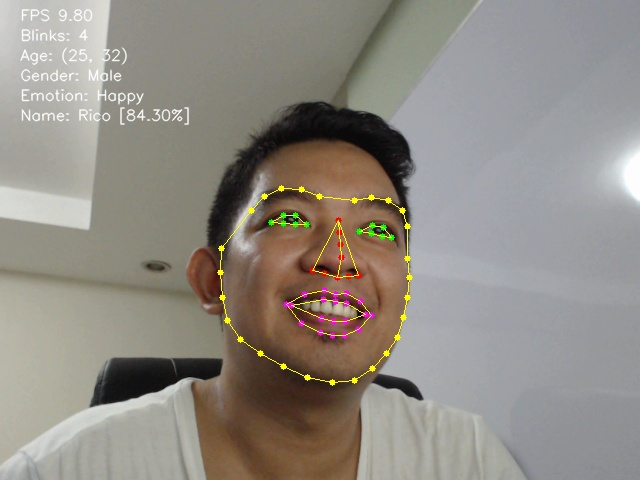
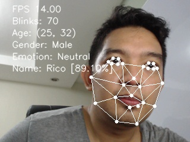
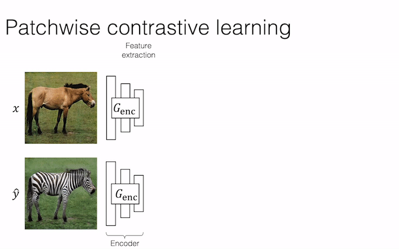

### This REPO contains all the Github repositories that i found useful in the process of Learning and Implementing AI Usecases.

1. [LibfaceID](https://github.com/richmondu/libfaceid), is implemented as a one stop for detection, liveness check, face recognition and emotion detection.

2. [RIDNet](https://github.com/saeed-anwar/RIDNet), is a Real Image Denoising with Feature attention from ICCV 2019 in Pytorch

3. [Avatarify](https://github.com/alievk/avatarify), using First Order Motion Model, creates photos to talk, has a demo of showing it in video conferencing apps. more [here too](https://github.com/DashBarkHuss/100-days-of-code/blob/master/post-log.md#avatarify-1)

4. [Matterport Mask R-CNN](https://github.com/matterport/Mask_RCNN), is a tensorflow implementation of Mask-RCNN. Pretty easy to use. REsults below

5. [Face-api.js](https://github.com/justadudewhohacks/face-api.js), is a java script for Face dtection, Recognition, Emotion Detection, Age, Gender detection and for landmarks too. more [here](https://justadudewhohacks.github.io/face-api.js/docs/index.html)

6. [DeepFace](https://github.com/ildoonet/deepface) is a face detection and recognition model using tensorflow with mobilenet and ssd

7. [FaceNet](https://github.com/davidsandberg/facenet), for Face Recognition in Tensorflow with 10K stars

8. [CenterMask2](https://github.com/youngwanLEE/centermask2) on top of Detectron2, is way faster and lighter than Mask R-CNN using Pytorch.

9. [Genetic drawing](https://github.com/anopara/genetic-drawing) just with python, opencv, matplotlib in jupyter notebook has impressive results, check below

10. [3D Instagram](https://github.com/cyrildiagne/instagram-3d-photo), is a context aware layered Depth inpainting.

            
11. [Efficient Panoptic Segmentation](http://panoptic.cs.uni-freiburg.de/), is a state of the Model for Panoptic Segmentation from cvpr 2020.

12. [SRCNN](https://debuggercafe.com/image-super-resolution-using-deep-learning-and-pytorch/) for super resolution of images in pytorch along with implementation.

13. High performance Face Recognition library in pytorch [here](https://github.com/ZhaoJ9014/face.evoLVe.PyTorch)

14. Image to Image translation with pytorch using CycleGAN [here](https://github.com/taesungp/contrastive-unpaired-translation)

### Audio
1. [Transformer TTS](https://github.com/as-ideas/TransformerTTS), is implementation of Non Auto regressive transformer based Neural network for Text to Speech.
- Audio results [here](https://as-ideas.github.io/TransformerTTS/)
- More related to TExt to Speech is [here](https://github.com/as-ideas)

2. [Voice Activity Detection](https://github.com/filippogiruzzi/voice_activity_detection) to Classify Noise or Speech audio using tensorflow

3. Mozilla [Deepspeech](https://github.com/mozilla/DeepSpeech) for Speech to Text with close results.

4. [DeepXI](https://github.com/anicolson/DeepXi) for Noise Supression

5. [Dual RNN](https://github.com/JusperLee/Dual-Path-RNN-Pytorch) for Speech seperation in pytorch, samples [here](https://www.likai.show/Pure-Audio/index.html)

6. [Tacotran2 ](https://github.com/NVIDIA/tacotron2/blob/master/inference.ipynb) [[1]](https://developer.nvidia.com/blog/generate-natural-sounding-speech-from-text-in-real-time/), [[2]](https://google.github.io/tacotron/publications/tacotron2/index.html), [[3]](https://pytorch.org/hub/nvidia_deeplearningexamples_tacotron2/), [[4]](https://colab.research.google.com/github/r9y9/Colaboratory/blob/master/Tacotron2_and_WaveNet_text_to_speech_demo.ipynb) for Text to speech, audio samples [here](https://nv-adlr.github.io/WaveGlow)

7. For Speech Denoise/Enhancement [[1]](https://sthalles.github.io/practical-deep-learning-audio-denoising/), [[2]](https://towardsdatascience.com/speech-enhancement-with-deep-learning-36a1991d3d8d), [[3]](https://labs.imaginea.com/shabda-a-neural-speech-denoiser/), [[4]](https://paperswithcode.com/paper/phase-aware-speech-enhancement-with-deep-1#code), [[5]](https://devpost.com/software/crisp-speech), [[6]](https://jmvalin.ca/demo/rnnoise/), [[7]](https://github.com/mosheman5/DNP)

### Text
1. [Text summarizer](https://github.com/as-ideas/headliner)
2. [bentrevett pytorch seq2seq](https://github.com/bentrevett/pytorch-seq2seq), is a implementation of few sequence-to-sequence (seq2seq) models with PyTorch and TorchText.
3. [Text summarization for meetings and conferences](https://github.com/JudeLee19/HMNet-End-to-End-Abstractive-Summarization-for-Meetings) in pytorch. results here in last page of research [here](https://arxiv.org/pdf/2004.02016.pdf)

### OpenCV
1. [Tennis shot counter](https://github.com/prateekjoshi565/Tennis-Shot-Counter), is a real time score counter on your wall everytime you hit a wall in particular spot while playing tennis.

### MAths
1. [Just the Maths](https://archive.uea.ac.uk/jtm/contents.htm), Quick notes on almost every topic in Maths
### Learn how to contribute to Open source projects in Github [here](https://www.dataschool.io/how-to-contribute-on-github/)
