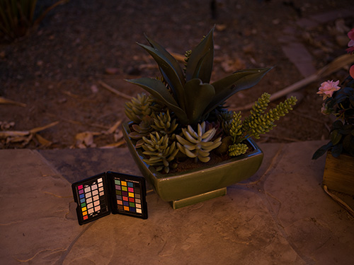

### This REPO contains all the Github repositories that i found useful in the process of Learning and Implementing AI Usecases.

##### Rahul agarwal list of [resources](https://github.com/MLWhiz/data_science_blogs/tree/master/resources) that helped him

1. [LibfaceID](https://github.com/richmondu/libfaceid), is implemented as a one stop for detection, liveness check, face recognition and emotion detection.

2. [RIDNet](https://github.com/saeed-anwar/RIDNet), is a Real Image Denoising with Feature attention from ICCV 2019 in Pytorch

3. [Avatarify](https://github.com/alievk/avatarify), using First Order Motion Model, creates photos to talk, has a demo of showing it in video conferencing apps. more [here too](https://github.com/DashBarkHuss/100-days-of-code/blob/master/post-log.md#avatarify-1)

4. [Matterport Mask R-CNN](https://github.com/matterport/Mask_RCNN), is a tensorflow implementation of Mask-RCNN. Pretty easy to use. REsults below

5. [Face-api.js](https://github.com/justadudewhohacks/face-api.js), is a java script for Face dtection, Recognition, Emotion Detection, Age, Gender detection and for landmarks too. more [here](https://justadudewhohacks.github.io/face-api.js/docs/index.html)

6. [DeepFace](https://github.com/ildoonet/deepface) is a face detection and recognition model using tensorflow with mobilenet and ssd

7. [FaceNet](https://github.com/davidsandberg/facenet), for Face Recognition in Tensorflow with 10K stars

8. [CenterMask2](https://github.com/youngwanLEE/centermask2) on top of Detectron2, is way faster and lighter than Mask R-CNN using Pytorch.

9. [Genetic drawing](https://github.com/anopara/genetic-drawing) just with python, opencv, matplotlib in jupyter notebook has impressive results, check below

10. [3D Instagram](https://github.com/cyrildiagne/instagram-3d-photo), is a context aware layered Depth inpainting.

            
11. [Efficient Panoptic Segmentation](http://panoptic.cs.uni-freiburg.de/), is a state of the Model for Panoptic Segmentation from cvpr 2020.

12. [SRCNN](https://debuggercafe.com/image-super-resolution-using-deep-learning-and-pytorch/) for super resolution of images in pytorch along with implementation.

13. High performance Face Recognition library in pytorch [here](https://github.com/ZhaoJ9014/face.evoLVe.PyTorch)

14. Image to Image translation with pytorch using CycleGAN [here](https://github.com/taesungp/contrastive-unpaired-translation)

15. [MMDetection](https://github.com/open-mmlab/mmdetection), A winner tool for [kaggle Wheat detection competition](https://www.kaggle.com/c/global-wheat-detection/discussion/172569)

16. Image manipulation detection [[paper1]](https://arxiv.org/pdf/1911.08217v3.pdf) [[code1]](https://github.com/HuizhouLi/Constrained-R-CNN) [[paper2]](https://openaccess.thecvf.com/content_cvpr_2018/papers/Zhou_Learning_Rich_Features_CVPR_2018_paper.pdf) [[code2]](https://github.com/LarryJiang134/Image_manipulation_detection)

17. Low light Image enhancement in [[pytorch]](https://github.com/Li-Chongyi/Zero-DCE) and in [[tensorflow]](https://github.com/tuvovan/Zero_DCE_TF)
<table><tr><td></td></tr><tr><td></td></tr></table>

18. [[Darknet]](https://github.com/AlexeyAB/darknet) for detecting objects in the Dark using YOLO V4, python, coco, opencv

19. [[Photo_to_Cartoon]](https://github.com/minivision-ai/photo2cartoon) with pytorch

20. GAN for SuperResolution [[TecoGAN]](https://github.com/thunil/TecoGAN) 

21. High Resolution network for photo realistic transformation [[here]](https://github.com/limingcv/Photorealistic-Style-Transfer)

22. Bringing Old photos back to life [[here]](https://github.com/microsoft/Bringing-Old-Photos-Back-to-Life)

23. [[Transformer Encoder visualized]](https://github.com/mertensu/transformer-tutorial/blob/master/transformer_encoder.ipynb)

24. [Background matting](https://github.com/senguptaumd/Background-Matting), The world is a green screen in both pytorch and tensorflow and [Unofficial implementation of Background matting in pytorch](https://github.com/foamliu/Deep-Image-Matting-PyTorch)

25. Context aware layered depth inpainting [here](https://github.com/vt-vl-lab/3d-photo-inpainting)

26. Processing Key Information Extraction from Documents using Improved Graph Learning-Convolutional Networks" (ICPR 2020)[https://github.com/wenwenyu/PICK-pytorch]

27. Vision Transformer in Pytorch [here](https://github.com/lucidrains/vit-pytorch) and explained nicely [here](https://jacobgil.github.io/deeplearning/vision-transformer-explainability) and VIT on Cifar [here](https://github.com/tahmid0007/VisionTransformer/blob/main/Google_ViT.py)

28. MMTracking(Single object tracking, Multiple Object tracking) [here](https://github.com/open-mmlab/mmtracking)

29. Tensorflow StyleGAN2 [here](https://github.com/nikhiltiru/stylegan2)

30. Resnet Inspired Identity function involved RepVGGNet with More Accuracies than Resnet [[here]](https://github.com/DingXiaoH/RepVGG)

31. [Tamming Transformers](https://github.com/CompVis/taming-transformers) for High Resolution Images 

32. [VisTR](https://github.com/Epiphqny/VisTR) End-to-End Video Instance Segmentation with Transformers

33. [Layout Praser](https://layout-parser.github.io/) with [Example1](https://layout-parser.readthedocs.io/en/latest/example/load_coco/index.html) and [Example2](https://layout-parser.readthedocs.io/en/latest/example/parse_ocr/index.html)

            
34. Detect the only object you want to identify in Image [- MDETR](https://ashkamath.github.io/mdetr_page/)
            
35. Pose detection with 33 keypoints to run even in Browser from TensorflowJS. Link [here](https://blog.tensorflow.org/2021/05/high-fidelity-pose-tracking-with-mediapipe-blazepose-and-tfjs.html)

### Audio
1. [Transformer TTS](https://github.com/as-ideas/TransformerTTS), is implementation of Non Auto regressive transformer based Neural network for Text to Speech.
- Audio results [here](https://as-ideas.github.io/TransformerTTS/)
- More related to TExt to Speech is [here](https://github.com/as-ideas)

2. [Voice Activity Detection](https://github.com/filippogiruzzi/voice_activity_detection) to Classify Noise or Speech audio using tensorflow

3. Mozilla [Deepspeech](https://github.com/mozilla/DeepSpeech) for Speech to Text with close results.

4. [DeepXI](https://github.com/anicolson/DeepXi) for Noise Supression

5. [Dual RNN](https://github.com/JusperLee/Dual-Path-RNN-Pytorch) for Speech seperation in pytorch, samples [here](https://www.likai.show/Pure-Audio/index.html)

6. [Tacotran2 ](https://github.com/NVIDIA/tacotron2/blob/master/inference.ipynb) [[1]](https://developer.nvidia.com/blog/generate-natural-sounding-speech-from-text-in-real-time/), [[2]](https://google.github.io/tacotron/publications/tacotron2/index.html), [[3]](https://pytorch.org/hub/nvidia_deeplearningexamples_tacotron2/), [[4]](https://colab.research.google.com/github/r9y9/Colaboratory/blob/master/Tacotron2_and_WaveNet_text_to_speech_demo.ipynb) for Text to speech, audio samples [here](https://nv-adlr.github.io/WaveGlow)

7. For Speech Denoise/Enhancement [[1]](https://sthalles.github.io/practical-deep-learning-audio-denoising/), [[2]](https://towardsdatascience.com/speech-enhancement-with-deep-learning-36a1991d3d8d), [[3]](https://labs.imaginea.com/shabda-a-neural-speech-denoiser/), [[4]](https://paperswithcode.com/paper/phase-aware-speech-enhancement-with-deep-1#code), [[5]](https://devpost.com/software/crisp-speech), [[6]](https://jmvalin.ca/demo/rnnoise/), [[7]](https://github.com/mosheman5/DNP)

8. Speech seperation by localization by UOW [[here]](https://grail.cs.washington.edu/projects/cone-of-silence/)

9. Single Channel Multiple speaker voice seperation [here](https://github.com/facebookresearch/svoice) and SOTA samples [here](https://enk100.github.io/speaker_separation/)

9. [NVIDIA Nemo](https://github.com/NVIDIA/NeMo) is a toolkit from NVIDIA for COnversational AI applications like Speech synthesis, ASR, Speech to Text, and NLP

### Text
1. [Text summarizer](https://github.com/as-ideas/headliner)
2. [bentrevett pytorch seq2seq](https://github.com/bentrevett/pytorch-seq2seq), is a implementation of few sequence-to-sequence (seq2seq) models with PyTorch and TorchText.
3. [Text summarization for meetings and conferences](https://github.com/JudeLee19/HMNet-End-to-End-Abstractive-Summarization-for-Meetings) in pytorch. results here in last page of research [here](https://arxiv.org/pdf/2004.02016.pdf)

### OpenCV
1. [Tennis shot counter](https://github.com/prateekjoshi565/Tennis-Shot-Counter), is a real time score counter on your wall everytime you hit a wall in particular spot while playing tennis.
2. [CDeC Network](https://github.com/mdv3101/CDeCNet) for table detection in Documents by IIIT Hyderabad

### MAths
1. [Just the Maths](https://archive.uea.ac.uk/jtm/contents.htm), Quick notes on almost every topic in Maths
2. Calculus for Deep learning by jeremyhoward [here](https://arxiv.org/pdf/1802.01528v2.pdf)
### Learn how to contribute to Open source projects in Github [here](https://www.dataschool.io/how-to-contribute-on-github/)
### Model compression with pruning [[here]](https://www.wadhwaniai.org/2020/09/09/compression-deployment/)

### Spark AR course [[here]](https://sparkar.facebook.com/blog/introducing-spark-ar-curriculum/)

### Master Pytorch
- [NN Programming and Deeplearning with Pytorch](https://deeplizard.com/learn/playlist/PLZbbT5o_s2xrfNyHZsM6ufI0iZENK9xgG)
- [DeepLearningWizard Deep learning course](https://www.deeplearningwizard.com/deep_learning/intro/)
- [Dive into Deep learning from D2L.ai](http://www.d2l.ai/)
- [Official Deep learning with pytorch book](https://pytorch.org/assets/deep-learning/Deep-Learning-with-PyTorch.pdf)
